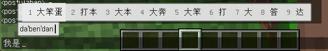
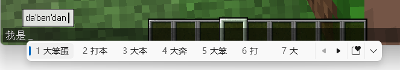

# IngameIME for FishModLoader (Minecraft 1.6.4-MITE)

[[English](README.md) / 简体中文]

IngameIME 是一个为 Minecraft 提供输入法支持的客户端模组。本分支把 [IngameIME-1.12.2](https://github.com/DHJComical/IngameIME-1.12.2) 的核心功能移植到 **Minecraft 1.6.4-MITE + FishModLoader 3.4.2**。

- **✓** 中文输入
- **✓** 输入法候选窗
- **✓** 小窗口 / 全屏支持
- **✓** 游戏过程中输入法不锁死

> 没有任何 GUI 打开时，IngameIME 会自动停用原生输入上下文，避免中文输入法截获 WASD、空格这类操作键。因此即使系统当前处于中文输入状态，玩家关闭聊天等输入界面后仍然可以正常移动、疾跑、操作游戏，移动键不会被输入法吞掉。

## 效果展示

- **由 IngameIME 在游戏内绘制候选窗与预编辑文本（默认）**

在 `config/ingameime.json` 中设置：

```json
"uiless": {
  "Windows": { "value": true }
}
```



- **使用 Windows 原生候选窗**

```json
"uiless": {
  "Windows": { "value": false }
}
```



## 运行要求

- Windows
- Minecraft `1.6.4-MITE`
- FishModLoader `>=3.4.0`
- Java 17 或更高

## 构建

```bash
./gradlew build
```

构建产物：

```text
build/libs/IngameIME-1.0.0.jar
```

启动开发客户端：

```bash
./gradlew runClient
```

## 配置

配置文件生成在：

```text
config/ingameime.json
```

使用 FishModLoader 自带的 JSON 配置格式。每个条目是一个对象，含 `value` 字段与可选的
`_comment` 说明。颜色为 ARGB 十六进制字符串，例如 `"0xFF000000"`——之所以存字符串，是因为
`0xEBEBEBEB` 这类值超出有符号 32 位整数范围，写成十进制既不可读也容易被改成越界值。

| 分类 | 键 | 类型 | 默认值 | 含义 |
| --- | --- | --- | --- | --- |
| `api` | `Windows` | 字符串 | `TextServiceFramework` | 输入法后端。`TextServiceFramework`（推荐）或 `Imm32`（旧版兜底）。 |
| `uiless` | `Windows` | 布尔 | `true` | `true` 由模组在游戏内绘制候选列表；`false` 使用 Windows 原生候选窗。 |
| `general` | `TurnOffOnMouseMove` | 布尔 | `false` | 鼠标移动时关闭输入法。 |
| `modetext` | `AlphaMode` | 字符串 | `A` | 英文模式的指示文本。 |
| `modetext` | `NativeMode` | 字符串 | `中` | 本地语言模式的指示文本。 |
| `debug` | `DebugLog` | 布尔 | `false` | 输出普通调试日志。 |
| `debug` | `VerboseLog` | 布尔 | `false` | 输出详细排查日志（输入法回调、候选、预编辑、光标位置）。日志量很大。 |
| `theme` | `TextColor` | 颜色 | `0xFF000000` | 预编辑/候选文本颜色。 |
| `theme` | `BackgroundColor` | 颜色 | `0xEBEBEBEB` | 控件背景色。 |
| `theme` | `IndexColor` | 颜色 | `0xFF555555` | 候选序号颜色。 |
| `theme` | `SelectedBackgroundColor` | 颜色 | `0xEBEBEBEB` | 选中候选项的背景色。 |
| `theme` | `CursorColor` | 颜色 | `0xFF000000` | 预编辑光标颜色。 |
| `theme` | `BorderColor` | 颜色 | `0x80000000` | 控件边框颜色。 |
| `theme` | `Padding` | 整数 | `3` | 控件内边距。 |
| `theme` | `CandidatePadding` | 整数 | `5` | 候选项内边距。 |
| `theme` | `BorderWidth` | 整数 | `1` | 控件边框宽度，设为 `0` 关闭边框。 |

## 功能

### 原版文本框

支持原版 `GuiTextField`，包括：

- 聊天输入框
- 创造模式物品搜索框
- 其他基于原版 `GuiTextField` 的界面

创造模式搜索框对 ESC 与 Enter 有额外处理：

- 按 ESC 不应插入控制字符或 `esc` 文本
- 按 Enter 不应插入控制字符或 `cr` 文本
- 正常中文输入仍能提交进搜索框

### 告示牌与成书

本移植包含 1.6.4 专属控件：

- `SignControl`：支持告示牌输入
- `BookControl`：支持可写书输入

### 游戏内输入状态

没有 GUI 打开时，IngameIME 保持原生输入上下文为停用状态，避免中文输入法吞掉 WASD 等操作键。

## 架构

模组通过 Mixin 与 AccessWidener 挂钩游戏，不再有 coremod，也不再对 Minecraft 成员做运行期反射。

| 钩子 | 位置 | 作用 |
| --- | --- | --- |
| `MinecraftMixin` | `displayGuiScreen` HEAD/RETURN | 界面关闭/打开时驱动输入法状态机。 |
| `MinecraftMixin` | `toggleFullscreen` HEAD/RETURN | 销毁并重建输入上下文，因为 HWND 会变。 |
| `MinecraftMixin` | `runTick` RETURN | 客户端 tick 末尾：排空回调/提交队列，轮询开关键与鼠标移动。 |
| `EntityRendererMixin` | `updateCameraAndRender` RETURN | 绘制预编辑/候选覆盖层。 |
| `GuiTextFieldMixin` | `setFocused` HEAD | 跟踪焦点变化以激活/停用输入法。 |
| `GuiTextFieldMixin` | `textboxKeyTyped` HEAD | 吞掉输入法送来的按键名序列。 |
| `GuiContainerCreativeMixin` | `keyTyped` HEAD | 为创造搜索框预备控制键检测。 |
| `ChatAllowedCharactersMixin` | `isAllowedCharacter`、`filerAllowedCharacters` | 放行非 ASCII 文本，同时拒绝控制字符。 |
| `GuiScreenAccessor` | `keyTyped` 的 `@Invoker` | 兜底路径：把提交文本喂给当前界面。 |

`ingameime.accesswidener` 放宽控件定位光标所需的私有字段（`GuiTextField`、
`GuiScreenBook`、`GuiEditSign`），以及成书编辑用到的两个 `GuiScreenBook` 私有方法。

`Internal` 负责原生库加载、HWND 获取、输入法激活状态、回调队列、提交过滤，以及游戏过程中的强制停用。

### 为什么覆盖层画在 `updateCameraAndRender`

原 Forge 版注入在 `Minecraft.runGameLoop()` 里 `checkGLError("Post render")` 之前。
在 1.6.4 中该调用点位于 `Display.update()` **之后**，也就是缓冲交换之后。改为注入
`EntityRenderer.updateCameraAndRender()` 的 RETURN，覆盖层紧跟在当前界面绘制之后、
且仍在交换之前，因此必然可见。

## 关于运行期名称映射

FishModLoader 在启动时把游戏 jar 由 `official` 重映射为 `named`
（见 `net.xiaoyu233.fml.relaunch.Launch`），因此 Minecraft 类与成员在运行期保持可读名。
模组代码**不会**被重映射，也不生成 refmap，所以本仓库的 Mixin 目标直接写 `runTick`、
`net/minecraft/GuiTextField` 这样的可读名字符串。

注意 MITE 使用扁平的 `net.minecraft.*` 包：是 `net.minecraft.GuiTextField`，
不是 `net.minecraft.client.gui.GuiTextField`。

## 疑难排查

**主菜单或语言界面上 `FontRenderer.getCharWidth` 抛 `ArrayIndexOutOfBoundsException`**

与本模组无关——未改动的示例模组在同一开发环境下会以同样方式崩溃。FishModLoader 用一份
包含 CJK 的大字符集替换了 `ChatAllowedCharacters`（`fix.AllowedCharFix` 读取 `font.txt`），
而 `getCharWidth` 用字符在该字符集中的下标去索引仅 256 项的 `charWidth` 数组。

**候选窗不出现**

检查 `uiless.Windows` 是否为 `true`。为 `false` 时使用的是 Windows 原生候选窗，而非游戏内覆盖层。

**完全没有输入法，日志提示原生库加载失败**

模组自带 `IngameIME_Java-{x64,x86,arm64}.dll`，按 `os.arch` 选择加载。仅支持 Windows；
其他平台日志会报不支持的平台，模组保持静默。

## 致谢

基于 IngameIME 项目及其原生 JNI 绑定。模组元数据中列出的致谢：

- Windmill_City
- DHJComical
- RuiXuqi
- Andrea Frederica
- Circulate233
